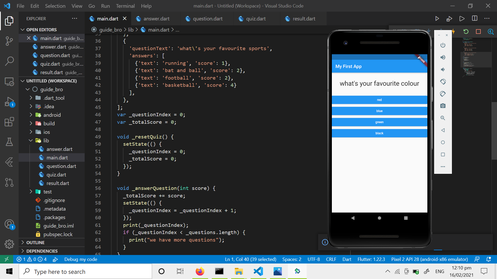
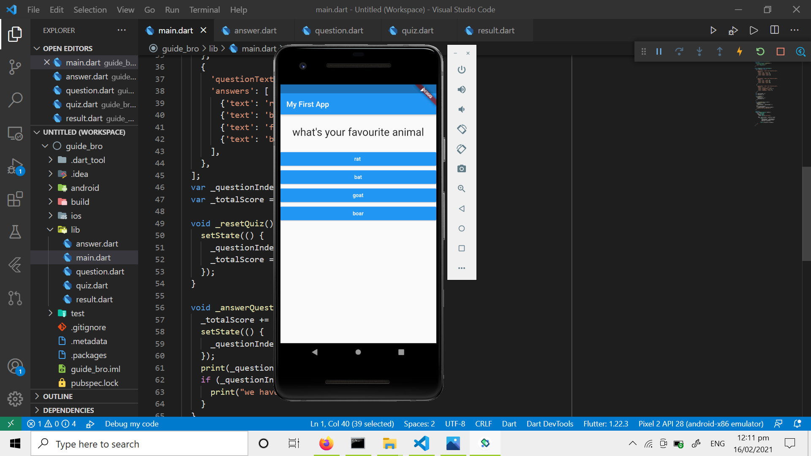

# QUIZ-APP
 
 # OUTPUT

# My first question looks like:

 
 Here i select blue.

My second  question looks like:

Here i select goat.

My third  question looks like:

Here i select football.

Final image shows the quality of yours on the basis of your choosen answers.
Every option has score associated with it .
I added the scores and comment your quality on the basis of it.

Here, I added the button to restart the quiz.
